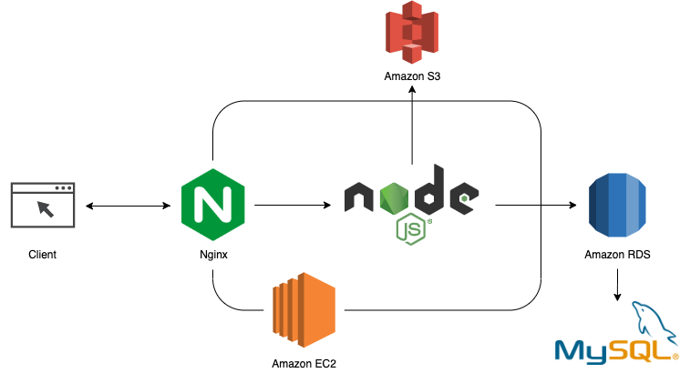
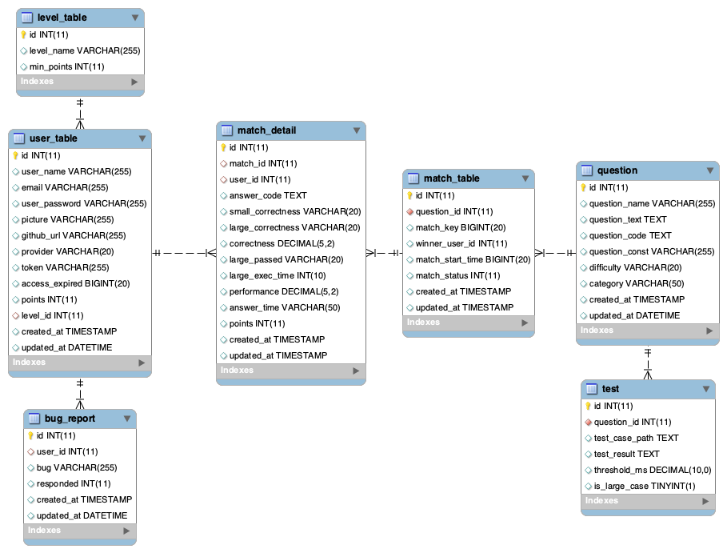
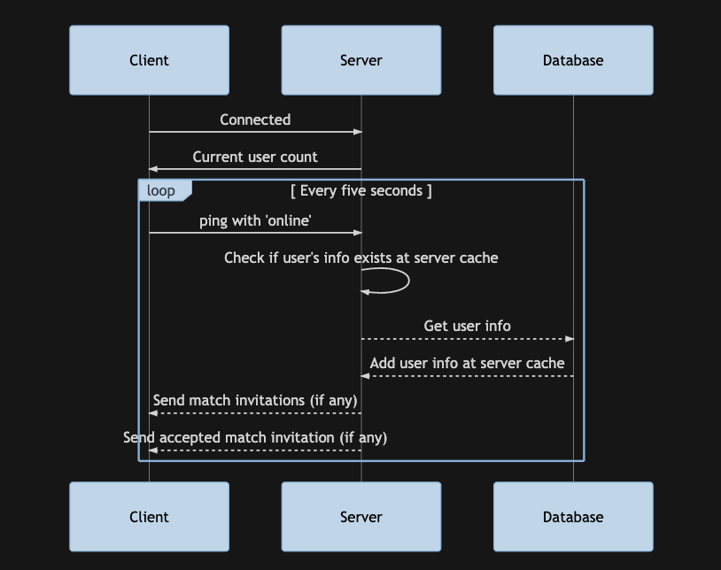
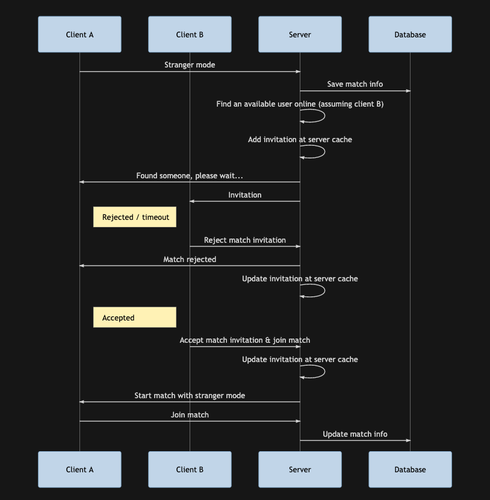
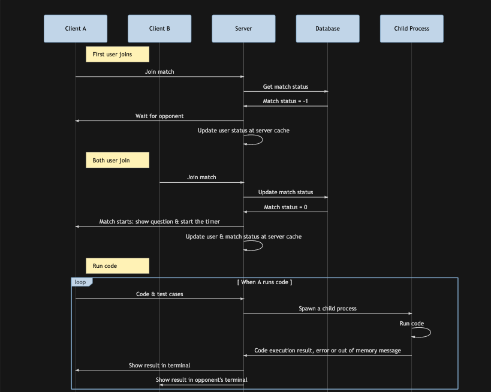
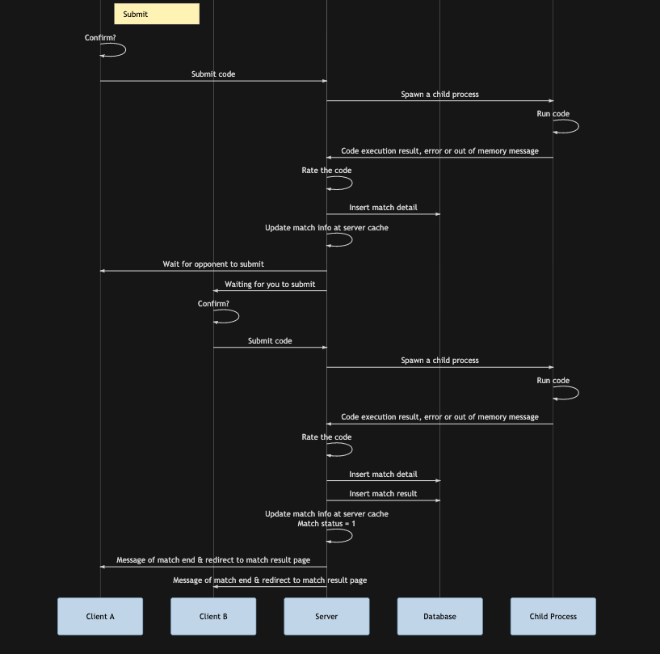
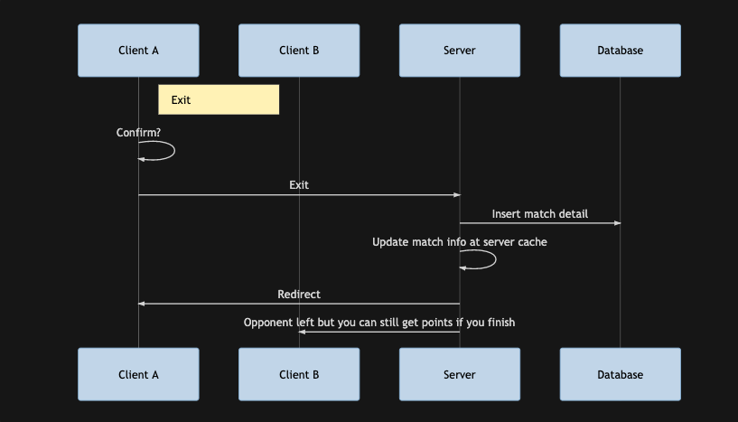
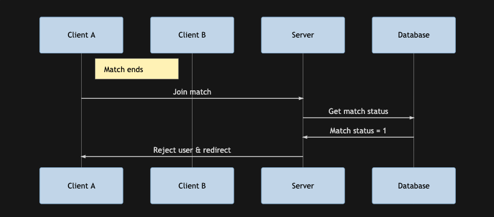
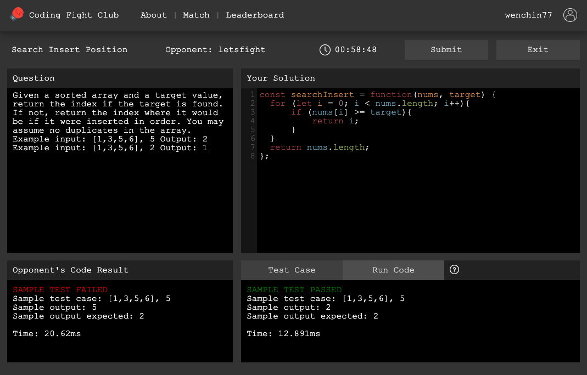
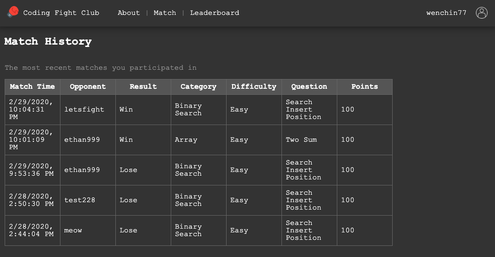

# Coding Fight Club

A software platform that helps engineers sharpen their coding skills via live competitions on algorithms

## Table of content
* [Technologies](#technologies)
* [Structure](#structure)
* [Database design](#database-design)
* [Features](#features)
* [Socket flowchart](#socket-flowchart)
* [Demo](#demo)
* [Inspiration](#inspiration)
* [Author](#author)

## Technologies

### Backend

* Node.js
* Express.js
* AWS EC2

### Frontend

* HTML
* CSS
* JavaScript
* Pug
* Axios

### Web Socket
* Socket io

### Database

* MySQL
* AWS RDS

### Networking

* HTTP & HTTPS
* Domain Name System (DNS)
* Nginx
* SSL Certificate (Let's Encrypt)

### Test

* Jest
* Supertest
* Artillery

### Others

* AWS S3
* Google login API
* GitHub login API
* Docker

## Structure

## Database design

## Features
### Features ready
* Live competition: 
  * Match pages show instant mock terminal results of you and your opponent
* Match modes choices:
  * Users can choose between the random stranger mode (with other available users online) and the invitation mode
  * Users can choose their preferred difficulty and the category of an upcoming match
* Code rating:
  * The server rates your code based on correctness (percentage of test cases passed) and performance (if the execution time of large test cases passes their according thresholds)
* User-related features:
  * Leaderboard ranks the top users
  * Homepage shows real-time number of online users

### To-do features
* Single mode for code practices
* Increase questions of the library
* Chat rooms for messaging among users
* Community among users

## Socket flowchart

### Real-time user pinging
Senario: every user connected pings every five seconds

### Starting matches with stranger mode
Senario: user A (on client A) starts a match with stranger mode and user B (on client B) is invited

### In a match
Senario: user A (on client A) is in a match with user B (on client B) when nobody exits the match

Senario: user A (on client A) is in a match with user B (on client B) when A exits the match in the middle of the match

Senario: user A (on client A) attemps to join a match that has ended

## Demo
* Match page

* Match history page

## Inspiration
Project inspired by [Codewars](https://www.codewars.com) and [Codility](https://www.codility.com/), questions based on [LeetCode](https://leetcode.com/)

## Author
Wenchin Chuang [@wenchin77](https://github.com/wenchin77)
