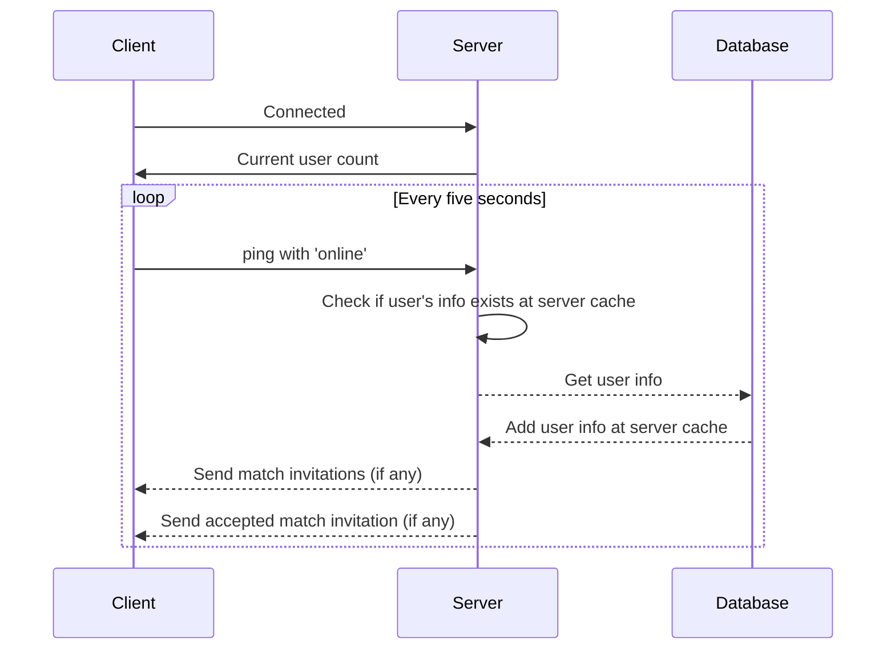
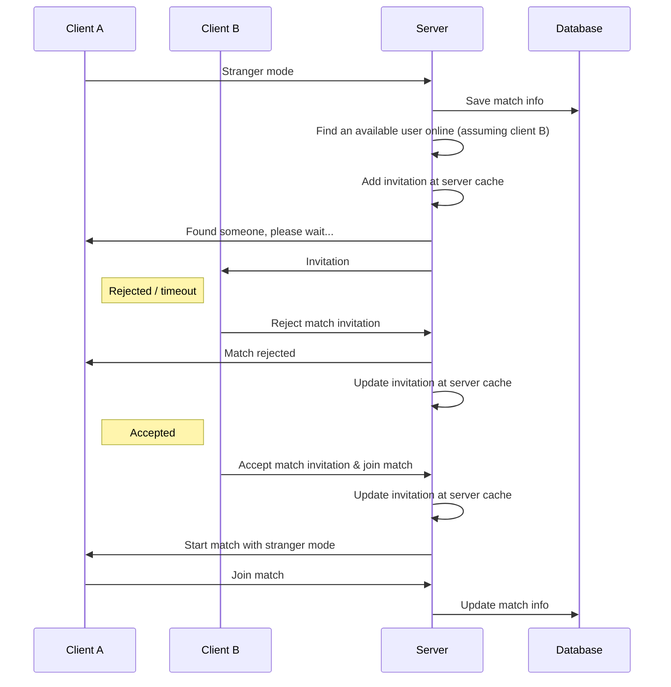
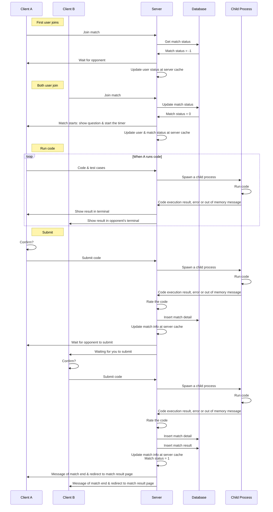
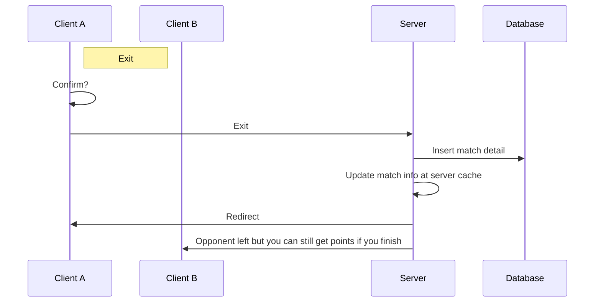
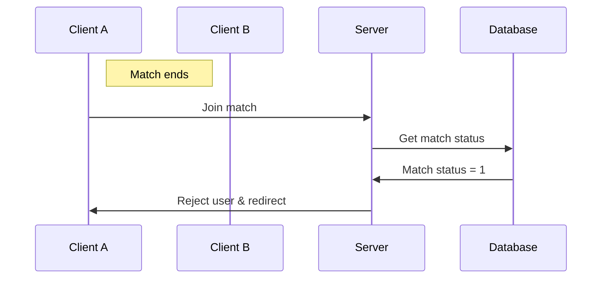

## Socket flowchart

### Real-time user pinging

Senario: every user connected pings every five seconds

### Starting matches with stranger mode

Senario: user A (on client A) starts a match with stranger mode and user B (on client B) is invited

### In a match

Senario: user A (on client A) is in a match with user B (on client B) when nobody exits the match

Senario: user A (on client A) is in a match with user B (on client B) when A exits the match in the middle of the match

Senario: user A (on client A) attemps to join a match that has ended

